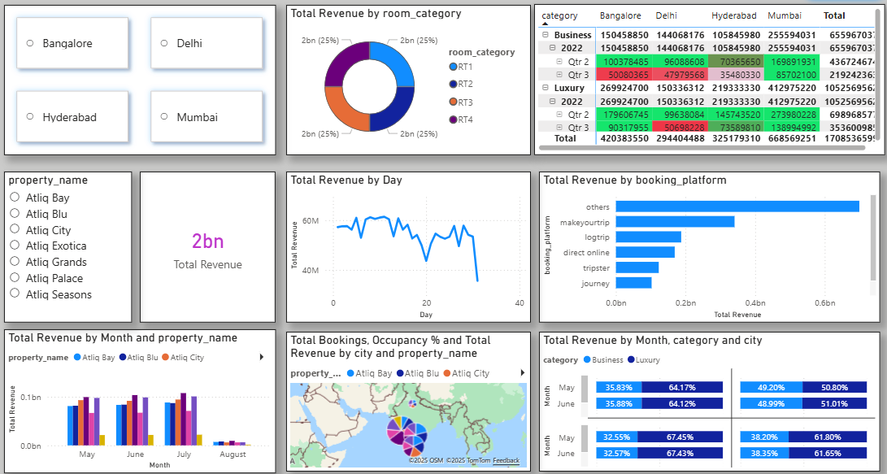
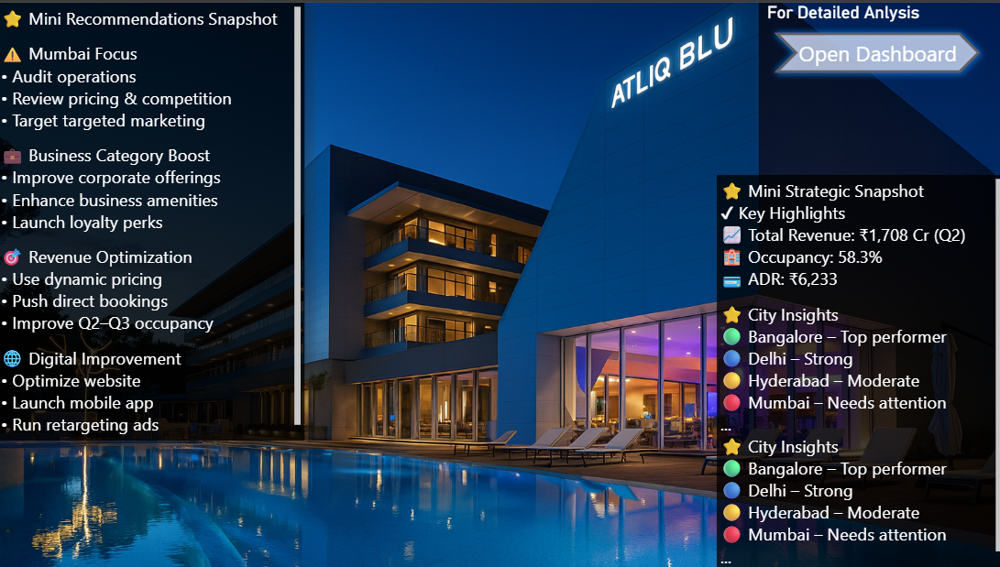

# Hotel Revenue Management Dashboard

## 📊 Live Dashboard
**[Click Here to View Live Interactive Dashboard →](https://app.powerbi.com/view?r=eyJrIjoiNGRiYWIyYTEtMDAwMS00MDg4LWFjOTUtM2U2NDdhMWU3ZWQ1IiwidCI6ImJlNmRiMjQyLTRmZTctNDJiMi1hZTE1LTZkODQ4NmNkNDc3ZiJ9)**

### Dashboard Preview

*Interactive dashboard with filters for city, property, booking platform, and time period*

*Strategic insights and actionable recommendations*

## 🎯 Business Problem
Hotel chain experiencing revenue decline across multiple properties in Bangalore, Mumbai, Delhi, and Hyderabad. Need to identify underperforming areas and optimize booking channels.

## 📈 Key Insights
- **Total Revenue**: ₹1,708 Crores
- **Occupancy Rate**: 58.3%
- **Average Daily Rate**: ₹6,233
- **Top Performer**: Bangalore
- **Needs Focus**: Mumbai operations

## 🔧 Analysis Process
1. **Data Collection**: 5 CSV files (3 dimension + 2 fact tables)
2. **Data Cleaning**: Removed outliers, null values, and inconsistencies
3. **Dashboard Creation**: Power BI visualization with interactive filters
4. **Insights Generation**: Revenue analysis by city, booking platform, and room category

## 📁 Files Included
- `dim_date.csv` - Date dimension
- `dim_hotels.csv` - Hotel properties
- `dim_rooms.csv` - Room categories
- `fact_aggregated_bookings.csv` - Aggregated booking data
- `fact_bookings.csv` - Detailed booking transactions
- `Hotel_Analysis.pdf` - Detailed analysis report

## 💡 Key Recommendations
- Focus on Mumbai market recovery
- Optimize direct booking channels
- Implement dynamic pricing strategies
- Enhance business category offerings

## 🛠️ Tools Used
- **Power BI** - Dashboard & Visualization
- **Python/Excel** - Data Cleaning & Transformation
- **DAX** - Custom metrics and calculations

---
*Dashboard is publicly accessible - no sign-in required*